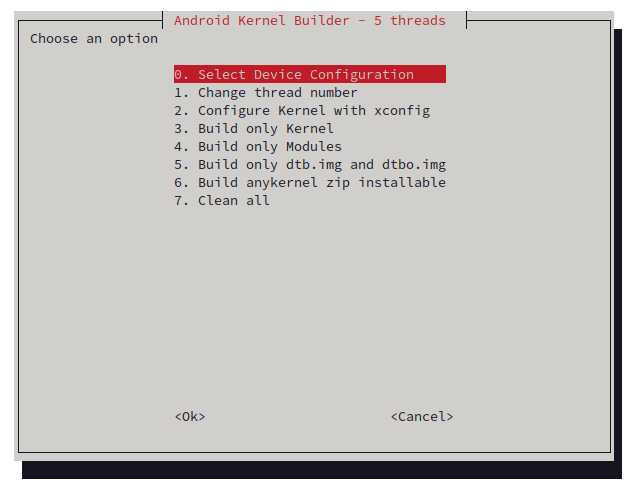

# Android Kernel Builder

## How to use
- Clone your kernel to ./kernel
- type bash build.sh
- Select your device config
- Build kernel, module or dtb/dtb.img
- Build anykernel zip
- Your zip will be in build/kernel.zip

## Dependencies
- whiptail
- dtc (Device Tree Compiler)
- ccache (optional)
